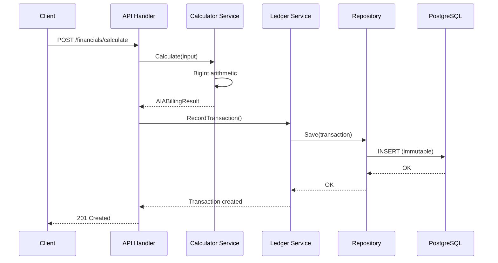

# 🏗️ SubFlow Architecture

> Enterprise Construction Financial Ledger & Compliance Engine

**Architect:** Muhammet Ali Büyük  
**Contact:** iletisim@alibuyuk.net  
**Website:** [alibuyuk.net](https://alibuyuk.net)

---

## 1. Overview

SubFlow is a modular monolith application built with Domain-Driven Design (DDD) principles and Hexagonal Architecture (Ports & Adapters). It manages construction project finances including progress payments (hakediş), retainage, and compliance with AIA G702/G703 standards.

---

## 2. System Architecture

```
┌─────────────────────────────────────────────────────────────────┐
│                         CLIENTS                                  │
│         (React SPA / Mobile App / Third-party Integrations)     │
└───────────────────────────────┬─────────────────────────────────┘
                                │
                                ▼
┌─────────────────────────────────────────────────────────────────┐
│                     API GATEWAY (Fiber)                          │
│              Rate Limiting │ Auth │ CORS │ Logging              │
└───────────────────────────────┬─────────────────────────────────┘
                                │
                                ▼
┌─────────────────────────────────────────────────────────────────┐
│                    ADAPTER LAYER (/internal/adapter)             │
│  ┌──────────────┐  ┌──────────────┐  ┌──────────────┐          │
│  │   Handlers   │  │  Repository  │  │  PDF Engine  │          │
│  │   (REST)     │  │  (Postgres)  │  │   (Maroto)   │          │
│  └──────────────┘  └──────────────┘  └──────────────┘          │
└───────────────────────────────┬─────────────────────────────────┘
                                │
                                ▼
┌─────────────────────────────────────────────────────────────────┐
│                     CORE LAYER (/internal/core)                  │
│  ┌──────────────────────────────────────────────────────────┐   │
│  │                    SERVICES                               │   │
│  │  ┌────────────┐  ┌────────────┐  ┌────────────┐         │   │
│  │  │ Calculator │  │   Ledger   │  │ WorkerPool │         │   │
│  │  │  (AIA)     │  │  Service   │  │   (PDF)    │         │   │
│  │  └────────────┘  └────────────┘  └────────────┘         │   │
│  └──────────────────────────────────────────────────────────┘   │
│  ┌──────────────────────────────────────────────────────────┐   │
│  │                    ENTITIES                               │   │
│  │  Project │ Transaction │ User │ Tenant │ Contract        │   │
│  └──────────────────────────────────────────────────────────┘   │
└─────────────────────────────────────────────────────────────────┘
                                │
                                ▼
┌─────────────────────────────────────────────────────────────────┐
│                    INFRASTRUCTURE                                │
│         ┌────────────┐              ┌────────────┐              │
│         │ PostgreSQL │              │   Redis    │              │
│         │  (Ledger)  │              │  (Cache)   │              │
│         └────────────┘              └────────────┘              │
└─────────────────────────────────────────────────────────────────┘
```

---

## 3. Directory Structure

```
/subflow
├── /cmd/api/              # Application entry point
│   └── main.go            # Fiber server initialization
│
├── /internal/
│   ├── /core/             # DOMAIN LAYER (Pure Business Logic)
│   │   ├── /entity/       # Domain models
│   │   │   ├── project.go
│   │   │   ├── transaction.go
│   │   │   ├── user.go
│   │   │   ├── tenant.go
│   │   │   └── errors.go
│   │   └── /service/      # Business services
│   │       ├── calculator.go    # AIA G702/G703 calculations
│   │       ├── ledger.go        # Double-entry bookkeeping
│   │       └── worker_pool.go   # Concurrent PDF generation
│   │
│   ├── /adapter/          # INFRASTRUCTURE LAYER
│   │   ├── /handler/      # HTTP REST controllers
│   │   ├── /repository/   # PostgreSQL data access
│   │   └── /pdf/          # PDF generation (Maroto)
│   │
│   └── /pkg/              # Shared utilities
│       └── logger.go      # Structured logging (zerolog)
│
├── /migrations/           # Database migrations
├── /web/                  # React frontend
│
├── Dockerfile             # Multi-stage production build
├── docker-compose.yml     # Development environment
├── Makefile               # Build automation
└── .github/workflows/     # CI/CD pipeline
```

---

## 4. Core Design Decisions

### 4.1 Financial Precision (BigInt)

All monetary values stored as `int64` (cents) to avoid IEEE 754 floating-point errors:

```go
// $1,234.56 is stored as 123456 cents
type Transaction struct {
    AmountCents int64  // 分 (cents) for precision
    Currency    string // ISO 4217 (TRY, USD, EUR)
}
```

### 4.2 Immutable Ledger

Transactions are **NEVER** updated or deleted. All changes are append-only:

```go
// Good: Append reversal transaction
ledger.RecordAdjustment(projectID, -amount, "Correction")

// Bad: Never do this
transaction.AmountCents = newAmount  // ❌ FORBIDDEN
```

### 4.3 Retainage Calculation

```
Labor Retainage     = Work Completed × 10%
Material Retainage  = Stored Materials × 5%
Current Payment Due = (Total Earned) - (Retainage) - (Previous Certificates)
```

---

## 5. API Design

| Method | Endpoint | Description |
|--------|----------|-------------|
| GET | `/health` | Health check |
| GET | `/api/v1/system/version` | System info (architect signature) |
| GET | `/api/v1/projects` | List projects |
| GET | `/api/v1/projects/:id/financials/summary` | Financial snapshot |
| POST | `/api/v1/applications/:id/generate-pdf` | Generate AIA document |

---

## 6. Technology Stack

| Layer | Technology | Purpose |
|-------|------------|---------|
| API | Go Fiber v2 | Zero-allocation web framework |
| Database | PostgreSQL 15 | ACID-compliant ledger storage |
| Cache | Redis 7 | Session & calculation caching |
| Frontend | React 18 + TypeScript | SPA with enterprise UX |
| CI/CD | GitHub Actions | Automated testing & deployment |
| Container | Docker (Alpine) | ~20MB production image |

---

## 7. Data Flow



---

## 8. Security

- **Multi-tenant isolation** via `tenant_id` on all queries
- **Audit logging** with actor tracking
- **Non-root Docker** user for production
- **CORS & Rate limiting** at gateway level

---

© 2026 Muhammet Ali Büyük. All rights reserved.
